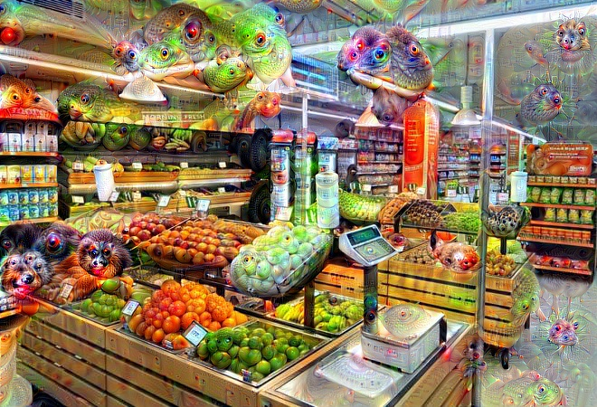
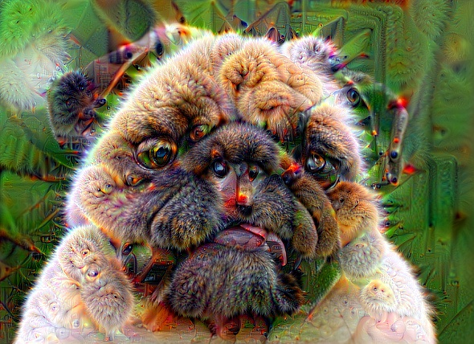

# Pytorch - Deep Dream
Minimal PyTorch implementation of Deep Dream.

## Examples
`$ python3 deep_dream.py --input_image images/supermarket.jpg`

    

`$ python3 deep_dream.py --input_image images/dog.jpg`

    

